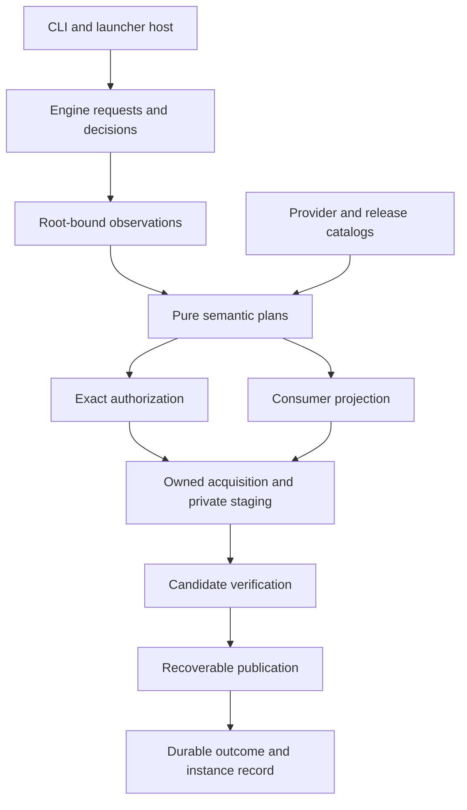

# Engine architecture

A shared engine turns author or instance requests into verified, recoverable file
changes. Consumer adapters transform exact release content into supported formats.

## Responsibilities

| Owner | Inputs | Outputs and authority |
| --- | --- | --- |
| `empack-core` | Validated values and observations | Pure identities, projections and plans; no I/O or runtime |
| `empack-lib::engine` | Requests, narrow ports, owned work scope | Prepared operations, decisions, verified publication and receipts |
| Application adapters | CLI/configuration and user responses | Typed requests and grants; no separate mutation implementation |
| Executable | Process arguments and host environment | Tokio runtime, signal handling, terminal lifecycle and exit code |
| Consumer adapters | Exact inventory and consumer recipe | Candidate manifest/archive/runtime layout with declared losses |
| Publisher | Verified candidate, read set and grant | Expected-old file changes and durable recovery evidence |

## Two managed roots

An authoring root contains intent, exact resolution, authored sources and generated
artifacts. An instance root contains game/runtime files and local installation
state. Their policies differ: an instance is not an author checkout, and its player
choices or mutable data must not be rewritten as author intent.

Shared acquisition, integrity, path validation, resource admission and publication
serve both roots. Separate request types prevent author dependency resolution from
silently selecting newer files while installing an already published release.

## Authority boundaries

Wire documents decode into untrusted DTOs. Validation constructs semantic values;
signature verification constructs authenticated release values. Neither implies
permission to write an instance. User or configured host policy grants an exact
prepared operation. Verified candidate and publisher constructors remain internal.

Provider IDs prove syntax until catalog evidence establishes existence. A content
address establishes observed bytes, not publisher identity. Root-relative paths
establish portable spelling, not native filesystem confinement. Each proof belongs
to the boundary that can establish it.

## Operational limits

Publication is recoverable across multiple files, not simultaneously visible to
external readers. Cooperative blocking work cannot be forcibly cancelled safely.
Admission estimates are accounting, not OS memory limits. Independent external
programs can bypass an instance lease; empack must document that boundary rather
than claiming exclusive control of every process on the host.

No packwiz object, file, ignore rule or installer defines empack identity or authorizes
an effect. Modrinth/CurseForge formats are explicit import/export adapters.
