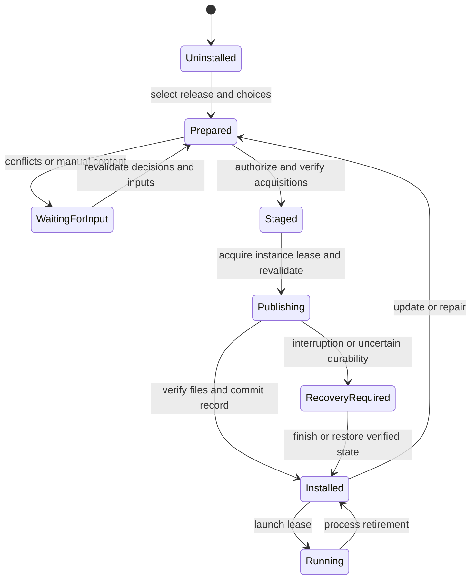

# Installed-instance lifecycle

An instance installs exact published releases while preserving player and operator
state. Author dependency resolution does not run implicitly during an update.

## Consumer layout

The completed record binds a fixed content layout: `game/` for native instances or
`.minecraft/` for Prism. `instance install --layout prism` selects the latter;
subsequent installation, repair and rollback retain it. Changing layout requires a
separate installation rather than moving ownership implicitly.

Prism prefers `minecraft/` if that directory exists. The Prism layout therefore
requires its absence and binds that absence through publication. An owned
`.empack-layout` marker keeps the selected game directory present even for an empty
release. A release cannot overwrite this marker or the `.empack-consumer` input
directory. Launcher components and
icons remain outside the content installer's ownership. [Prism directory selection](https://github.com/PrismLauncher/PrismLauncher/blob/develop/launcher/minecraft/MinecraftInstance.cpp)

`instance prepare RELEASE --sha256 ID` is the consumer entry point. It installs the
initial snapshot when no completed record exists. Otherwise it verifies and repairs
the active release with saved choices; it cannot replay the original package over a
later update. The initial descriptor must name the same pack and runtime. A runtime
change requires updating the consumer integration before launch. Preparation failure
returns an error and grants no permission to start the game.

Reference-delivery Prism instances use `PreLaunchCommand` to prepare content and
`WrapperCommand` to run `empack --workdir "$INST_DIR" --yes instance launch --`.
Prism supplies its selected Java executable and arguments after the wrapper's
arguments. Empack inherits the console streams, including Prism's launch protocol
on stdin, and holds the instance lease for that process lifetime. Java selection,
Minecraft libraries, authentication and launcher components remain Prism's
responsibility. [Prism wrapper execution](https://github.com/PrismLauncher/PrismLauncher/blob/develop/launcher/minecraft/launch/LauncherPartLaunch.cpp)

Reference-delivery server scripts prepare the snapshot before invoking
`instance launch` with the selected Java executable and recipe arguments. The engine
sets the game working directory; the script remains at the instance root. Failed
preparation prevents process startup, and a failed runtime produces a failing launch
command. Bundled snapshot scripts and Prism exports remain independently runnable
without empack. User-supplied launcher configurations are preserved as user input;
the generated integration's guarantees do not certify arbitrary replacement scripts.

## State transitions

Preparation failure keeps the last completed installation. A pending publication
blocks launch. An engine lock alone cannot stop a manually launched game; managed
launch holds an instance lease until the process retires. Launcher integrations
must either provide equivalent coordination or refuse updates while execution
cannot be safely established as stopped.

## Three-way file decisions

`previous` is the last installed baseline, `current` is captured native state, and
`incoming` belongs to the authenticated selected release after side/choice projection.
Comparisons include content, size and supported permission attributes.

| Previous | Current | Incoming | Decision |
| --- | --- | --- | --- |
| *none* | Absent | Managed file | Create |
| *none* | Any file | Managed file | Unowned collision, even if bytes match |
| Managed A | A | B | Replace A with verified B |
| Managed A | B | B | Retain matching desired bytes and accept B after verification |
| Managed A | Changed C | B or absent | Conflict; retain C |
| Managed A | Absent | B | Restore required content |
| Managed A | A | Absent | Remove exact unchanged file |
| Managed A | Absent | Absent | No file mutation; retire ownership |
| Any | Regular file | Seed | Preserve existing user bytes |
| Any | Absent | Seed | Create initial bytes without future replacement authority |
| Seed | Existing file | Managed | Explicit ownership decision required |
| Seed | Any file or absent | Absent | Preserve user state and retire seed tracking |
| Any | Directory/link/unsupported kind at selected file | File or removal | Reject unsafe shape |

An absent dependency in author intent is not sufficient evidence to remove shared
requirements. Conversely, an exact instance inventory and prior owned baseline can
justify retiring files absent from the next complete release.

## Configuration and mutable data

Managed configuration changes use the same three-way comparison as other files.
There is no automatic text merge based only on filename extension. A conflict offers
preserve, replace or a separately verified merge result. Replacing requires exact
observed-byte authorization.

`--preserve PATH` and `--replace PATH` resolve named conflicts using paths relative
to the game directory. Preparation captures the current bytes and permissions;
publication rejects changes after that capture. A decision naming an unrelated file,
a duplicate decision or a directory cannot authorize mutation. `--replace` also
restores publisher content over a previously accepted local deviation.

Preserving a managed file records a local override with both the selected publisher
identity and the accepted local identity. Repair and launch accept that exact local
baseline without claiming source authenticity for it. A later edit or a changed
incoming publisher baseline requires a fresh decision. When a release retires the
entry, the local file stays as user content and its override record retires.
`instance inspect` reports these deviations. Preview never records a decision.

`--merge PATH=FILE` selects a separately prepared local merge result for a managed
file. Empack captures its content address and size, verifies it into owned staging,
and applies the incoming file's permission policy. Publication binds the exact old
instance observation and records the merged bytes as a local override. The retained
publisher descriptor and source assertions remain unchanged. A missing, linked or
directory-valued merge source fails; a competing `--file` association for the same
logical file is ambiguous and fails. This command verifies selected bytes, not the
semantic correctness of the user's merge algorithm.

Initial configuration and world templates are seeds. Existing worlds, saves,
logs, player preferences and runtime-generated data are excluded from ordinary
release replacement and rollback. New releases cannot change a seed to managed
ownership without an explicit local decision.

## Update and repair

Update selects a published release under the configured authority. Repair restores
the recorded release and choices without advancing a channel or resolving newer
provider files. Both reacquire exact missing content and verify original assertions.
A provider URL refresh may not change exact selection or expected bytes.

Missing manual downloads retain a bounded continuation record outside disposable
cache, bound to release, instance, choices, original assertions and observed base.
Resuming revalidates all bindings and prepares a new operation for authorization.
The host stores `pending-instances` records and verified `pending-instance-content`
separately from disposable cache. Retention uses the shared continuation cleanup
lock; content remains protected while any record in that category exists. Records
contain no original host file paths or execution grant. Accepted merge bytes remain
local deviations, and subscription envelopes retain their authentication context.
`instance continue --file KEY=PATH` supplies remaining exact inputs.
`instance discard-pending` conditionally removes an observed record, including an
invalid or stale record; it does not touch installed game files.

## Rollback and retention

Managed rollback selects a previously completed release and uses the same conflict
checks. It never rewinds played-world data. Previous release descriptors and any
required rollback content have explicit retention leases; a short-lived publication
journal is not the release history store. Completed records retain authenticated
asset directories keyed by release identity. Repair and rollback use those locations
even when a channel changes or its keys are revoked, while still verifying the exact
retained descriptor and original content assertions. A saved location cannot select
a newer release or regain revoked update authority. Unavailable retained content is a reported
acquisition obligation, not permission to guess or reuse different bytes.

## Launch and offline policy

Snapshot is the default update policy. Prelaunch channel checks require explicit
subscription and trust. Offline launch is an explicit setting permitting the last
completed installation when a network update check fails. It cannot bypass a failed
signature, known incompatible runtime, unresolved conflict or pending recovery.
The CLI opts into the check with `instance launch --check-updates`; `--allow-offline`
requires that flag. Only the channel-fetch result can report transport unavailability.
Authentication, sequence publication, release acquisition and content activation are
outside the fallback boundary. HTTP refusals, size limits, cancellation and invalid
redirects remain errors. The expected completed release is bound into launch
preparation, preventing a concurrent replacement from changing the selected runtime's
input after the prelaunch decision. A channel runtime change requires consumer runtime
preparation before activation; a caller-selected program is not proof of compatibility.
Launch errors distinguish update availability, acquisition, publication and game
process failures. Updating empack itself requires independent tool policy.

## Native layout and snapshot application

The selected instance directory contains `game/` for installed content and
`.empack/instance.json` for ownership. Immutable release payloads are retained at
`.empack/releases/<sha256>.json`. Authoring documents and `pack/` are not created
or consulted. The root-bound instance record identifies its pack, side, installed
release, selected choices and prior completed releases. Copying the record to a
different native root does not authorize replacement there.

Snapshot application takes an explicit payload digest. The CLI form is
`empack --workdir <instance> instance install <release.json> --sha256 <digest>`.
`--side client|server` selects the environment. Relative immutable assets resolve
beneath the selected release directory through no-follow handles. `--file KEY=PATH`
associates a separately supplied file with its exact release identity; `--choice
KEY=VALUE` selects a stable alternative. Applying a snapshot never subscribes to
a channel or establishes publisher trust.

Preparation verifies supplied files and bundled assets without network access.
It can reuse disposable cache entries only after checking the release's address,
size and original assertions. A missing optional asset leaves an acquisition
obligation; an explicitly associated missing file, unsafe path or corrupt asset
remains an error. Cache lookup never creates the store. Approved execution may
cache local, supplied and downloaded bytes for exact repair after restart;
unavailable storage or cache-only capacity exhaustion does not block installation.
Missing referenced files appear as exact acquisition obligations in the preview.
Execution requires a network grant before using their HTTPS alternatives. Downloads
share the engine's transfer limits and resource admission; every selected file must
match both its original assertions and the release's content address before any
instance change is published. A failed transfer or verification preserves the
previous installation. A download URL never changes the selected file identity.

Provider acquisition refreshes only the declared project, version and file role.
Refreshed locators must remain compatible with the release's original assertions;
they cannot substitute a newer version. Provider world members share one verified
archive acquisition. Extraction checks each exact member address independently and
retains seed ownership. Approved execution may reuse and populate the disposable
verified-content cache; cached bytes remain subject to the same assertions.

A new instance uses declared choice defaults. Updates retain choices by stable key.
A newly introduced choice or an unavailable prior alternative requires a decision;
a changed publisher default does not overwrite a saved selection.
`instance options` lists saved values and available alternatives without mutation.
`instance options --choice KEY=VALUE` changes choices within the completed release;
it cannot select another release or create an uninstalled instance. Its preview,
acquisition, conflict checks and publication use the same instance operation. Repair
retains the new choices. Projection
rejects colliding paths before content staging, including case and Unicode aliases.

Preparation captures the prior record, retained descriptor, and the union of old
and incoming selected paths. Unrelated game data is outside this read set. Content
staging checks selected addresses and original source assertions independently.
Only actual changes enter the write set, while all captured observations remain
publication preconditions. Payload installation alone does not authorize game launch;
consumer/runtime preparation and launch coordination must also complete.

`instance inspect` reads the root-bound completed record and validates its retained
release descriptor. It does not inspect unrelated game bytes or mutate state.
`instance repair` retains the exact installed release, side and choices;
`instance rollback <release-id>` accepts only a retained completed release.
Both accept `--assets <directory>` and `--file KEY=PATH` for exact reacquisition.
Rollback can supply `--choice KEY=VALUE` when an older alternative needs a decision.
Neither command advances a channel or reduces a subscription's sequence floor.

Repair rejects a different release or changed choices even through the library API.
Rollback history authorizes selecting a descriptor, not overwriting changed managed
files. The same three-way comparison applies to all three commands. Previewing
maintenance captures and verifies inputs without replacing instance or game files.

## Caller-selected runtime execution

`instance launch -- PROGRAM ARGUMENTS...` runs a local runtime selected by the user
or launcher. Program and arguments remain separate native arguments; release
metadata cannot supply a program or shell source. The executable is resolved before
approval. Preparation verifies the completed record and its selected content;
missing or modified managed bytes require repair or a conflict decision first.
This entry point coordinates execution of an already prepared runtime. It does not
select Java, download game binaries or infer a launch command from release metadata.

The execution grant has a separate `run_runtime` permission. After approval, execution
acquires an exclusive instance-run lock and a shared publication lock, then rechecks
the captured observations. The instance-run lock prevents a second managed process;
the shared lock prevents update, cleanup and publication recovery from changing that
root while the process runs. Console streams are inherited without accumulating
output or imposing the short timeout used for build tools. Cancellation retires the
owned process tree before releasing the lease. The receipt carries the real process
exit status; a nonzero exit is a CLI failure. After the immediate process exits,
empack terminates remaining owned descendants and checks that the Unix process
group or Windows job has no active processes. A kill request alone cannot clear
runtime evidence. Failure to establish retirement within the bounded cleanup period
retains recovery evidence and blocks publication.

The host chooses the runtime and remains responsible for its compatibility and
external resource use. Empack's acquisition grant does not sandbox the runtime's
network or filesystem access. Independently started processes are outside this
coordination.

Before starting a managed process, empack durably records runtime ownership in its
host-private, root-bound publication state. Confirmed retirement removes that record.
A crash, panic or failure to establish retirement retains it, even when the operating
system has released the locks. Further publication and launch refuse the unresolved
record. A missing parent process is not proof that Java or its descendants stopped.

After stopping all remaining runtime processes, the operator can use
`instance recover-runtime --acknowledge-stopped`. This is an explicit assertion of
retirement, not process detection or a command to kill a recorded PID. Preparation
captures the exact recovery record. Execution requires both exclusive locks and
refuses a changed record or a live managed runtime. Preview never clears evidence.
