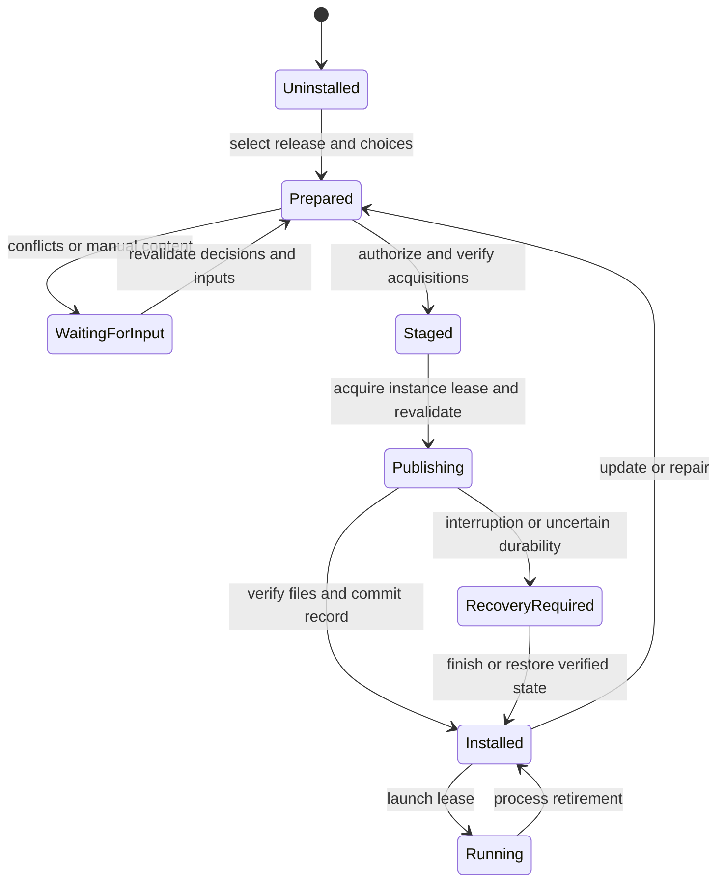

# Installed-instance lifecycle

An instance installs exact published releases while preserving player and operator
state. Author dependency resolution does not run implicitly during an update.

## State transitions

Preparation failure keeps the last completed installation. A pending publication
blocks launch. An engine lock alone cannot stop a manually launched game; managed
launch holds an instance lease until the process retires. Launcher integrations
must either provide equivalent coordination or refuse updates while execution
cannot be safely established as stopped.

## Three-way file decisions

`previous` is the last installed baseline, `current` is captured native state, and
`incoming` belongs to the authenticated selected release after side/choice projection.
Comparisons include content, size and supported permission attributes.

| Previous | Current | Incoming | Decision |
| --- | --- | --- | --- |
| *none* | Absent | Managed file | Create |
| *none* | Any file | Managed file | Unowned collision, even if bytes match |
| Managed A | A | B | Replace A with verified B |
| Managed A | B | B | Retain matching desired bytes and accept B after verification |
| Managed A | Changed C | B or absent | Conflict; retain C |
| Managed A | Absent | B | Restore required content |
| Managed A | A | Absent | Remove exact unchanged file |
| Managed A | Absent | Absent | No file mutation; retire ownership |
| Any | Regular file | Seed | Preserve existing user bytes |
| Any | Absent | Seed | Create initial bytes without future replacement authority |
| Seed | Existing file | Managed | Explicit ownership decision required |
| Seed | Any file or absent | Absent | Preserve user state and retire seed tracking |
| Any | Directory/link/unsupported kind at selected file | File or removal | Reject unsafe shape |

An absent dependency in author intent is not sufficient evidence to remove shared
requirements. Conversely, an exact instance inventory and prior owned baseline can
justify retiring files absent from the next complete release.

## Configuration and mutable data

Managed configuration changes use the same three-way comparison as other files.
There is no automatic text merge based only on filename extension. A conflict offers
preserve, replace or a separately verified merge result. Replacing requires exact
observed-byte authorization.

Initial configuration and world templates are seeds. Existing worlds, saves,
logs, player preferences and runtime-generated data are excluded from ordinary
release replacement and rollback. New releases cannot change a seed to managed
ownership without an explicit local decision.

## Update and repair

Update selects a published release under the configured authority. Repair restores
the recorded release and choices without advancing a channel or resolving newer
provider files. Both reacquire exact missing content and verify original assertions.
A provider URL refresh may not change exact selection or expected bytes.

Missing manual downloads retain a bounded continuation record outside disposable
cache, bound to release, instance, choices, original assertions and observed base.
Resuming revalidates all bindings and prepares a new operation for authorization.

## Rollback and retention

Managed rollback selects a previously completed release and uses the same conflict
checks. It never rewinds played-world data. Previous release descriptors and any
required rollback content have explicit retention leases; a short-lived publication
journal is not the release history store. Unavailable retained content is a reported
acquisition obligation, not permission to guess or reuse different bytes.

## Launch and offline policy

Snapshot is the default update policy. Prelaunch channel checks require explicit
subscription and trust. Offline launch is an explicit setting permitting the last
completed installation when a network update check fails. It cannot bypass a failed
signature, known incompatible runtime, unresolved conflict or pending recovery.
Launch errors distinguish update availability, acquisition, publication and game
process failures. Updating empack itself requires independent tool policy.
